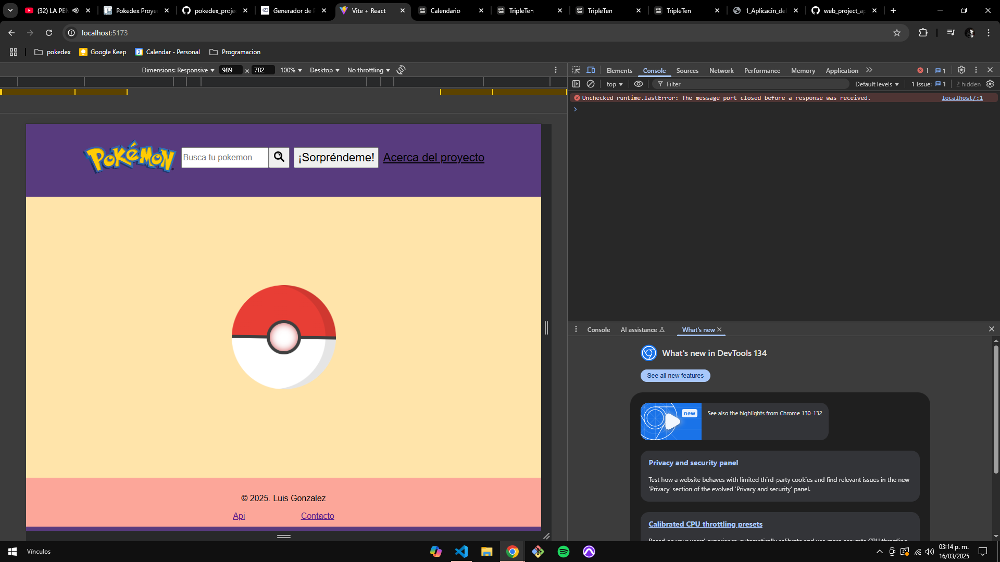
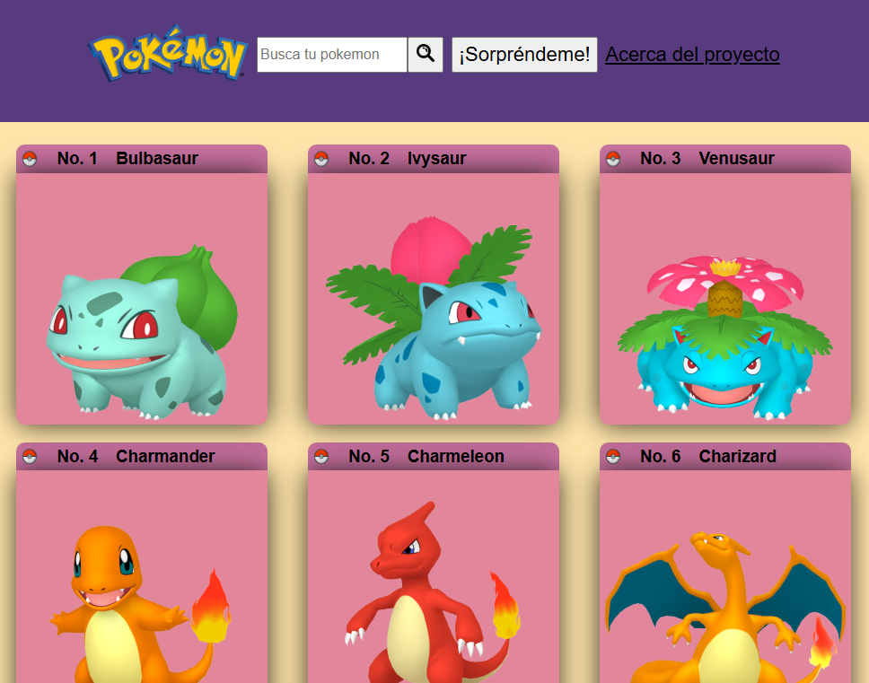
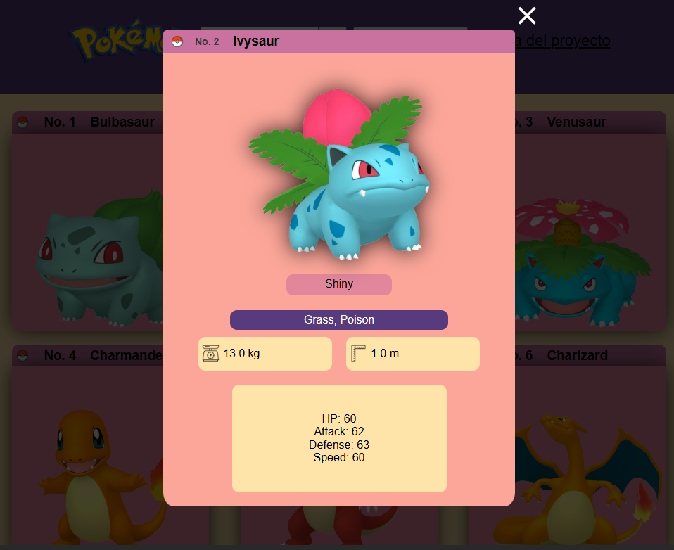

# Proyecto Frontend Pokédex

Este proyecto es una página web interactiva que permite consultar información detallada sobre los Pokémon de la primera generación. Utiliza HTML, CSS, JavaScript, React y Vite, y el código fue desarrollado en Visual Studio Code. Además, está integrado con la **PokeAPI** para obtener los datos en tiempo real.

---

## Características principales:

1. **Loader personalizado**: Un loader con una Pokébola girando se muestra mientras se carga el contenido de la API.

2. **Funciones destacadas**:
   - **Buscador**: Los usuarios pueden buscar Pokémon por nombre o número de Pokédex.
   - **Botón “¡Sorpréndeme!”**: Muestra un Pokémon aleatorio.
   - **Ventanas modales**: Muestran las estadísticas detalladas de cada Pokémon cuando se hace clic sobre ellos.
   - **Sonido de Pokémon**: Al hacer clic sobre un Pokémon, se puede escuchar el sonido correspondiente.

3. **Enlaces y documentación**: Se agregaron enlaces a los sitios oficiales utilizados en el proyecto, incluyendo la PokeAPI.

---

## Detalles del código:

- **Estructura de carpetas y archivos**: Se organizó el CSS utilizando la metodología **BEM**, creando directorios y subdirectorios para facilitar la gestión de los estilos y elementos dentro de la aplicación.
  
- **Carga de Pokémon**: Los datos de los Pokémon se cargan desde la PokeAPI. Se implementó un sistema de paginación que carga 20 Pokémon por vez, y los usuarios pueden cargar más si lo desean.

- **Manejo de estado en React**: Se utilizan `useState` y `useEffect` para manejar los estados de los Pokémon, la búsqueda y la visualización de los detalles de cada uno.

- **Componentes principales**:
  - **Header**: Incluye el buscador y el botón "¡Sorpréndeme!".
  - **Main**: Muestra la lista de Pokémon y permite ver más al hacer clic.
  - **PokemonIndividualCard**: Muestra detalles de un Pokémon individual.
  - **Footer**: Información adicional y enlaces relevantes.

---

## Resoluciones compatibles:

El proyecto está optimizado para las siguientes resoluciones:

1. **1280px** - Desktop
2. **800px** - Tablet
3. **320px** - Mobile

---

## :stars: Preview

---

## Link de mi página:

### https://github.com/luis-gn006/project-pokedex-frontend/

---

## Tecnologías utilizadas:

&nbsp;
&nbsp;
&nbsp;
&nbsp;